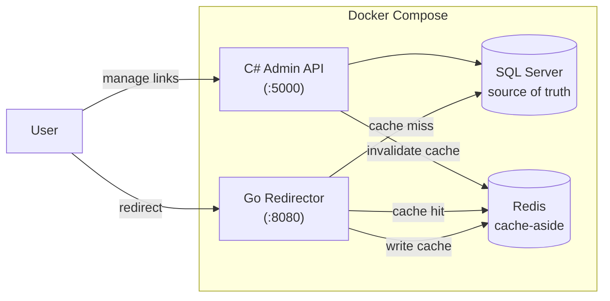
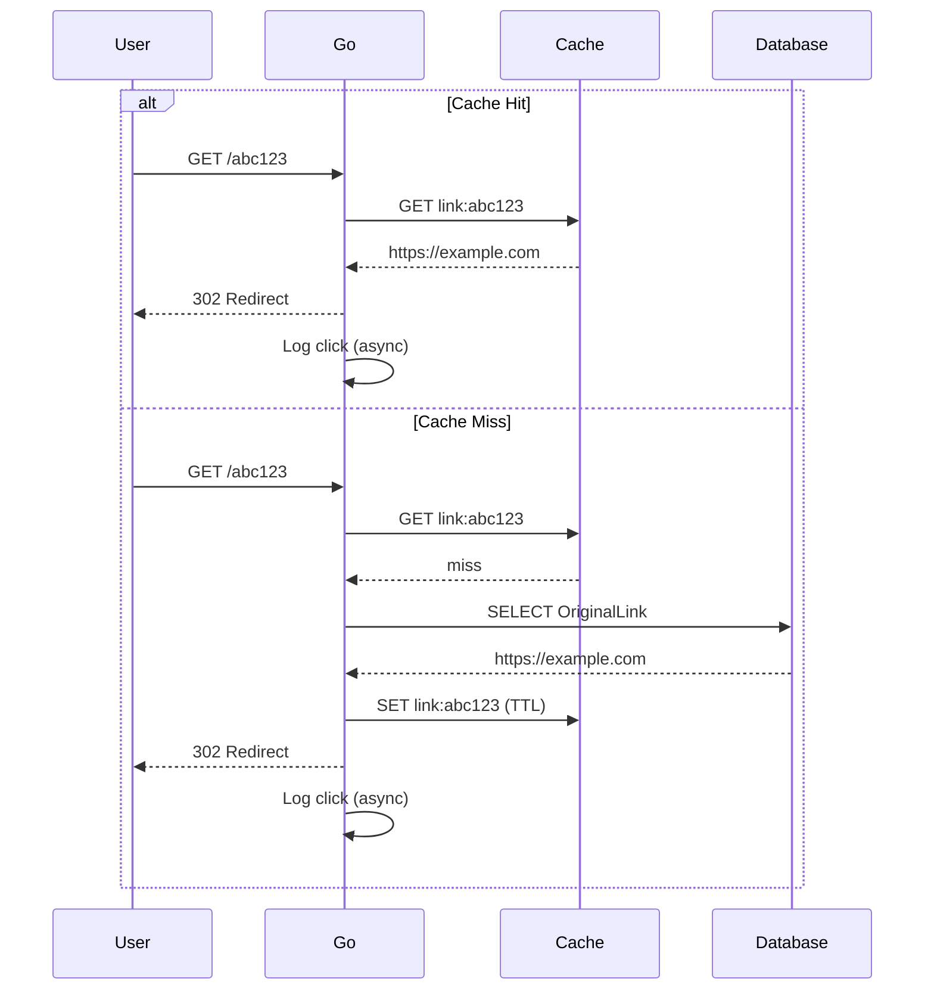
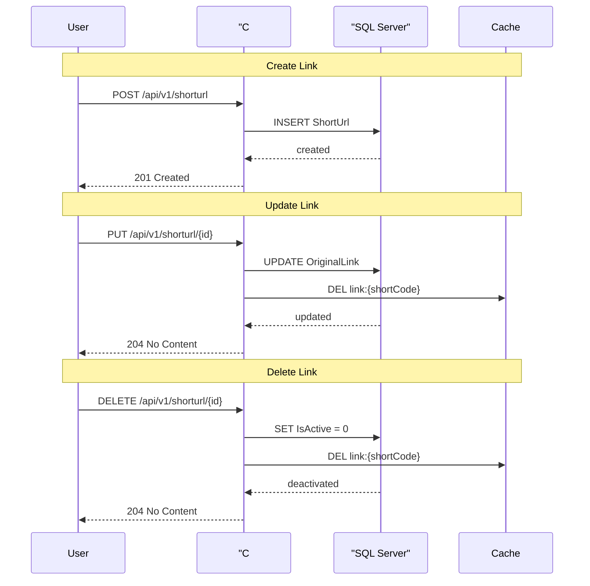

# ShortLink — Polyglot URL Shortener

A distributed URL shortener built with a **dual-stack architecture**: an **ASP.NET Core 9** admin API (Clean Architecture + CQRS with MediatR) for secure link management and analytics, and a **Go** redirector optimized for low-latency public redirects with Redis caching.

## Architecture

### System Overview



### Redirect Flow (Cache-Aside Pattern)



### Admin Flow (Link Management)



---

## Tech Stack

| Layer | Technology |
|---|---|
| **C# API** | ASP.NET Core 9, Clean Architecture, CQRS (MediatR), EF Core, FluentValidation |
| **Go Service** | Chi router, go-redis/v9, tollbooth (rate limiter), go-mssqldb |
| **Database** | SQL Server (Azure SQL Edge) |
| **Cache** | Redis (StackExchange.Redis, go-redis) |
| **Auth** | ASP.NET Core Identity + JWT Bearer |
| **Testing** | xUnit, FluentAssertions, Testcontainers (MsSql + Redis), Go table-driven tests |
| **DevOps** | Docker, Docker Compose, GitHub Actions |

---

## Features

### C# Admin API
- **JWT authentication** with ASP.NET Core Identity (register/login)
- **Role-based authorization** (Admin / User) with admin endpoints
- **Link CRUD** with ownership enforcement — users can only modify their own links
- **CQRS with MediatR** — commands and queries separated with validation pipelines
- **Redis cache invalidation** — link updates/deletes clear the cache key `link:{shortCode}`
- **Rate limiting** — 60 requests per minute per user (fixed window)
- **Click analytics** — daily clicks, top referrers, country stats, device stats
- **API versioning** — URL path based (`/api/v1/`)
- **Global exception handling** with ProblemDetails
- **Auto database migration** on startup via `MigrateAsync()`

### Go Redirector
- **Cache-aside pattern** — checks Redis first, falls back to SQL Server on miss, populates cache
- **Sub-50ms cache-hit responses** on the redirect hot path
- **TTL-bounded caching** — min of link expiration or 24h max
- **Per-IP rate limiting** — 20 requests per second via tollbooth
- **Async analytics pipeline** — click events captured via goroutines with zero user-facing latency
- **Health endpoint** (`GET /healthz`)
- **Fail-open on Redis errors** — redirects continue serving from database if Redis is unavailable

---

## Quick Start

```bash
# Clone the repository
git clone https://github.com/mohamedmahmoud345/ShortLink.git
cd ShortLink

# Start all services (API, Redirector, SQL Server, Redis)
docker compose up -d

# Verify everything is running
docker compose ps

# C# API:        http://localhost:5000
# Go Redirector: http://localhost:8080
# Swagger UI:    http://localhost:5000/swagger
```

### First use

```bash
# Register a new user
curl -X POST http://localhost:5000/api/v1/account/register \
  -H "Content-Type: application/json" \
  -d '{"userName":"testuser","email":"test@example.com","password":"SecurePass123!"}'

# Login to get JWT token
curl -X POST http://localhost:5000/api/v1/account/login \
  -H "Content-Type: application/json" \
  -d '{"email":"test@example.com","password":"SecurePass123!"}'

# Create a short link (use the token from login response)
curl -X POST http://localhost:5000/api/v1/shorturl \
  -H "Content-Type: application/json" \
  -H "Authorization: Bearer YOUR_TOKEN" \
  -d '{"url":"https://example.com"}'
```

---

## Testing

### C# Integration Tests (61 tests)

```bash
dotnet test Tests/ShortLink.IntegrationTests/
```

Tests use **Testcontainers** to spin up real SQL Server and Redis containers, then run tests against them. Covers:

| Test file | Count | Scope |
|---|---|---|
| `AuthTests.cs` | 13 | Register, login, JWT validation, role access |
| `ShortUrlTests.cs` | 25 | CRUD, ownership, refresh, inactive links, admin endpoints |
| `ClickEventTests.cs` | 23 | Record clicks, analytics queries, internal token auth |

### Go Unit Tests (7 tests)

```bash
cd go/redirector
go test -v ./internal/http/
```

Table-driven tests with interface mocks — no external dependencies needed. Runs in under 40ms. Covers cache hit, cache miss, cache fail-open, expired links, DB errors.

---

## Project Structure

```
├── src/
│   ├── ShortLink.Api/              # ASP.NET Core Web API
│   │   ├── Controllers/            # API endpoints
│   │   ├── DTOs/                   # Request/response DTOs
│   │   ├── Filters/                # InternalOnly filter
│   │   └── Middlewares/            # Global exception handler
│   ├── ShortLink.Application/      # CQRS (MediatR), services, DTOs
│   │   ├── Features/               # Commands + Queries per domain
│   │   │   ├── Account/            # Register, Login
│   │   │   ├── ShortUrl/           # CRUD, Refresh, Queries
│   │   │   ├── ClickEvent/         # Record, Analytics queries
│   │   │   └── Admin/              # Admin queries
│   │   └── Services/               # Interfaces (ICacheService, etc.)
│   ├── ShortLink.Domain/           # Entities, interfaces, enums
│   └── ShortLink.Infrastructure/   # EF Core, repositories, services
│       ├── Data/                   # DbContext, configurations, seeding
│       ├── Repositories/           # ShortUrl, ClickEvent, Admin
│       ├── Services/               # Auth, Cache, GeoIp
│       └── Migrations/             # EF Core migrations
├── go/
│   └── redirector/                 # Go redirect service
│       ├── cmd/redirector/         # Entry point
│       └── internal/
│           ├── http/               # Handlers + tests
│           ├── cache/              # Redis client
│           ├── analytics/          # Click event client
│           └── config/             # Environment config
├── Tests/
│   └── ShortLink.IntegrationTests/ # xUnit + Testcontainers
├── docker-compose.yml              # 4-service orchestration
└── .github/workflows/              # CI pipelines
```

---

## Environment Variables

### C# API (`shortlink-api`)

| Variable | Default | Description |
|---|---|---|
| `ConnectionStrings__conStr` | *required* | SQL Server connection string |
| `ConnectionStrings__RedisConnection` | *required* | Redis connection string |
| `Jwt__SecretKey` | *required* | JWT signing key |
| `Jwt__Issuer` | `ShortLink` | JWT issuer |
| `Jwt__Audience` | `ShortLink` | JWT audience |
| `SeedAdmin__Email` | *optional* | Admin email for seeding |
| `SeedAdmin__Password` | *optional* | Admin password for seeding |
| `INTERNAL_SECURE_TOKEN` | *required* | Shared secret for Go → C# analytics |

### Go Redirector (`redirector`)

| Variable | Default | Description |
|---|---|---|
| `PORT` | `8080` | HTTP listen port |
| `CON_STR` | *required* | SQL Server connection string (URL format) |
| `REDIS_ADDRESS` | *required* | Redis host:port |
| `REDIS_PASSWORD` | `""` | Redis password |
| `INTERNAL_SECURE_TOKEN` | *required* | Must match C# API token |
| `CS_API_URL` | *required* | C# analytics endpoint URL |

---

## CI/CD

Two GitHub Actions workflows:

| Workflow | Trigger | Steps |
|---|---|---|
| **.NET CI** | Changes to `src/`, `Tests/` | `dotnet restore → build → test` (61 tests) |
| **Go CI** | Changes to `go/` | `go mod download → build → test` (7 tests) |

---

## License

MIT
